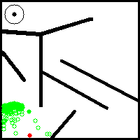
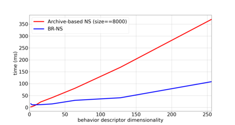

# Description

This repository provides an implementation the BR-NS method published in

    @inproceedings{Salehi2021BRNS,
      title={BR-NS: an Archive-less Approach to Novelty Search},
      author={Salehi, Achkan and Coninx, Alexandre and Doncieux, Stephane}
      booktitle={Proceedings of the 2021 Genetic and Evolutionary Computation Conference},
    }

under GNU GPL. 

The **B**eharvior **R**econgnition **N**ovelty **S**earch (BR-NS) method is a variant of Novelty Search (NS) which does not need an archive, does not rely on K-nearest neighbours search and does not make any assumptions on the structure of the underlying behavior space. It is closely related to what is being increasinly refered to as Random Network Distillation, with the important distinction that it operates on behavior space instead of observation space.

While empirical evaluations seem to support that this NS variant retains a certain number of the desirable properties of classical archive-based NS such as population youth and large offspring to parent distance, it explores and covers the behavior space in a less progressive and more stochastic way. This is because the exploration is guided by the random embeddings that are generated at initialisation. An example of its progress on the well-known deceptive maze toy problem from Lehaman and Stanley's seminal paper on Novelty Search ([[1]](#1)) is given below:

# Requirements

* python3.6+
* LibFastSim (https://github.com/jbmouret/libfastsim)
* PyFastSim (https://github.com/alexendy/pyfastsim)
* fastSimGym (https://github.com/alexendy/fastsim\_gym)
* For the ant experiment, a Mujoco license (http://www.mujoco.org/) and the `mujoco_py` module are required.

Other dependencies can as usual be found in `requirements.txt`. Note that the code in this repository was tested with pytorch `1.3.1`, and may require some adaptation to run with more recent versions.

# Lauching experiments

    $cd NS
    $python3.6 -im scoop -n <num_workers> NS.py --config <your_yaml_config>

# Computing statistics

The `Q` function (*i.e.* the mean novelty of the population at generation i as estimated by the novelty function of generation j) can be computed for both classical NS and BR-NS using the short functions in `Analysis/cycling_analysis.py`. The latter require as input the root directory where the restults of experiments have been logged. Once the `Q` function is saved a matrix in `*npz` format, it can be used to compute the `kappa, eta` statistics from the paper using `AnalysisScripts/kappa_eta_eps.py`.

# Timing 

To facilitate execution time comparisons, a short script `NS/timing.py` has been added that decouples the complexity of Novelty computation (both for BR-NS and archive-based NS) from other part of the code. It simulates Novelty computations for a given number of generations and computes the mean time over that. An example timing estimation is given below (the population and offspring sizes are set as in the large ant experiment):

    py -i timing.py --min_d_e 1 --max_d_e 8 --pop_sz 25 --off_sz 25

# Misc References
<a id="1">[1]</a> 
Lehman, J. and Stanley, K.O., 2011. Abandoning objectives: Evolution through the search for novelty alone. Evolutionary computation, 19(2), pp.189-223.

